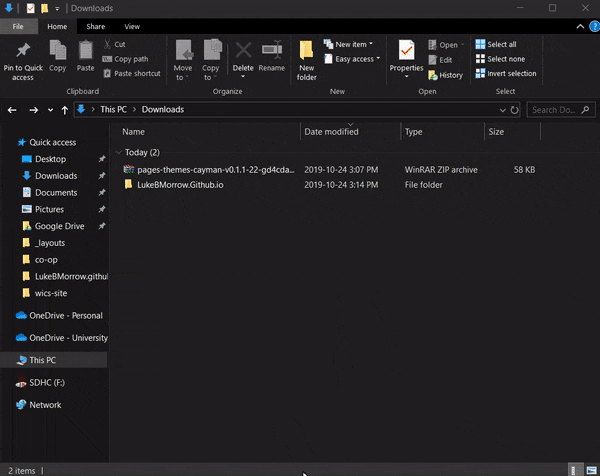

# Hosting a Markdown Resume on GitHub Pages
This tutorial will guide the reader through writing a resume with markdown and hosting this markdown resume on GitHub pages.

## Audience
In this tutorial, the assumption will be that the reader has had previous experience with git, GitHub, and markdown. Additionally, this tutorial will be useful to anyone who is interesting in learning how to host a resume online for free.

## Prerequisites
|Have |Don't Have |  
|---|---|  
| Git  |  Atom |  
| GitHub |  |


## On to the Tutorial!

### Stage 1: Installing Atom
Now we are going to install atom for writing our markdown resume.
1. Go to the [Atom Website](https://atom.io/).
2. Download the installer for your computer.
3. Run Setup.  

Welcome to Atom!  

Now that Atom has been installed, the markdown resume can be started.

### Stage 2: Writing Markdown
Writing in markdown is fast to learn. With markdown, a simple resume is easy to create.  
What follows is the name specification of the resume file.
  > **Markdown**: resources to learn, or brush up on, markdown can be found in the [Resources](#Resources) section.

1. Open a file in Atom and save it as _index.md_
  >**Note**: Files name must be _index.md_ for a later step.

2. Write the resume in _index.md_.
  >**Note**: An existing resume can be copied instead.  

At this point, the reader should have a markdown resume. Now to put that resume on GitHub Pages.

### Stage 3: Using GitHub Pages
This stage will result in a hosted version the reader's resume online(for free). All this will take is a git repository.
1. Create a folder named: _[Username].github.io_.
2. Move _index.md_ into the _[Username].github.io_ folder.
3. Go to [GitHub](https://github.com/).
4. Create a new repository with the name _[Username].github.io_.
5. Initialize the _[Username].github.io_ folder with Git using:  

``` bash
  git init
  git remote add origin 'username'/'username'.github.io.git
  git add .
  git commit -m "initial commit."
  git push -u origin master
```

Now that the reader has a repository with the index.md file, the hosted resume can be found at the url: _[Username].github.io_. What comes next is styling.

### Stage 4: Styling Github Pages
After this stage, the hosted resume on GitHub Pages will be styled. This tutorial will be using the Cayman style and (optionally) editing the style.  
1. Download the [Cayman theme](https://pages-themes.github.io/cayman/).
2. Extract the contents of the .zip file into a folder.
3. Copy your _index.md_ into the extracted folder.
4. Copy all files from the extracted folder back to the _[Username].github.io_ folder.


##### Optional
> Go into the _layouts_ folder and edit _default.html_ to make changes to the layout:  
>**Note**: In this repo, the _default.html_ was changed to commented out the following blocks.
```html
    <header class="page-header" role="banner">
       <h1 class="project-name">{{ page.title | default: site.title | default: site.github.repository_name }}</h1>
       <h2 class="project-tagline">{{ page.description | default: site.description | default: site.github.project_tagline }}</h2>
       
         <a href="{{ site.github.repository_url }}" class="btn">View on GitHub</a>
       
       
         <a href="{{ site.github.zip_url }}" class="btn">Download .zip</a>
         <a href="{{ site.github.tar_url }}" class="btn">Download .tar.gz</a>
       
     </header>
   ```
   ```html
   <span class="site-footer-credits">This page was generated by <a href="https://pages.github.com">GitHub Pages</a>.</span>
   ```

5. Open the _ _config.yml_ file and change the _title_ and _description_ to something  appropriate.  
6. Commit and push these changes.

At this point, the reader should have a styled and hosted copy of their resume on GitHub Pages.

# Resources
**Markdown**:  
  * [Markdown Tutorial](https://www.markdowntutorial.com/) will walk you through each markdown tag with examples and practice problems.
  * [Daring Fireball](https://daringfireball.net/projects/markdown/basics) is made by the creator of markdown, and goes into depth on the conversion that happens between markdown and HTML.  
  * [Awesome Markdown](https://github.com/mundimark/awesome-markdown) is a compilation of resources for Markdown, if you want more markdown goodies, such as: "libraries, services, editors, tools, cheatsheets, etc.".

# FAQ
  Q: Do I have to use Atom?   
  A: No, any code editor will work. I chose Atom for its markdown previewer and Git integration.

  Q: Can I write my resume in HTML?  
  A: Yes, Simply name the _index.md_ file _index.html_ instead.


# Authors and Acknowledgments
Authored and maintained by [Luke Morrow](https://github.com/LukeBMorrow/) with help from _Thai Nguyen_ and _Dang Nguyen_  
[Cayman theme](https://github.com/pages-themes/cayman) is an open source project from GitHub.
